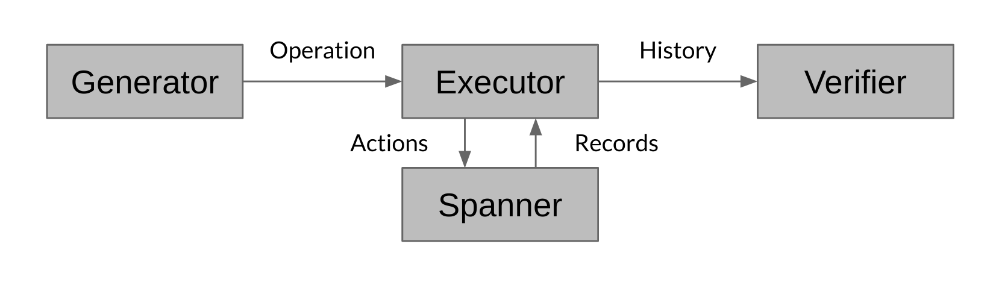

# Jepsen on Spanner

**This is not an officially supported Google product.**

Jepsen is a correctness verifcation tools for distributed systems for their
consistency under special scenarios. This project intended to apply Jepsen on
Cloud Spanner databases.

## Design Overview

This framework focuses on testing the consistency models of the Spanner database. It does this by setting up multiple workers on a Google Kubernetes Engine cluster and running operations from them against a Spanner instance. Depending on different types of benchmarks the framework measures, the operation types can be different, but they can all be broken down into read / write actions to Spanner. Each operation also records two entries in a history. Once all operations are performed, the history is extracted and fed to a verifier to check against the consistency model of that benchmark.

For the scope of this project, we have implemented two types of benchmarks: `bank` and `linearizability`.
- The `bank` benchmark treats the Spanner instance as a series of accounts with balances. It supports two types of operations: a `read` across all accounts, and a `transfer` between two accounts. The benchmark then verifies if the balances read reflect all previous successful `transfer` operations. Also support stale `read` operations.
- The `linearizability` benchmark treats the Spanner instance as a key-value store. It supports three types of operations: `read`, `write` or a `transaction` that contains a mixture of reads and writes. The verifier then checks for linearizability and external consistency models.

The configuration of the ratio between each type of operations and operation number etc. can be found in `test-config.json`.

##Installation
Make sure you have Java 11, Python 3 and `kubectl` installed.

Download this repo.

`git clone https://github.com/googleinterns/jepsen-on-spanner.git`

You need to set up a kubernetes cluster and port the settings to `kuberctl` as well. Using Google
Kubernetes Engine, execute:
 
```
gcloud container clusters create [cluster-name]
gcloud container clusters get-credentials [cluster-name]
```

##Usage

`python main.py [OPTION]`

####Options

`--project` specify the ID of the GCP project

`--instance` specify the Cloud Spanner instance to run test on

`--database` specify the name of the database to be created and tested on

`--delete, -d` cleanup kubernetes jobs / Spanner instance

`--redeploy, -r` redeploy the Jepsen-on-spanner executable to remote image

`--worker, -w` specify number of workers

`--benchmark, -b` specify the type of benchmark to run; supports `linearizability` and `bank`

`--job, -j` if specified, will run until invalid history found or error occurs

####Example

To run a linearizability benchmark once on 8 workers:

`python main.py -w 8 -b linearizability --project [projectID] --instance [instanceID] --database
[databaseID]`

To run a bank benchmark on 5 workers, redeploy the image on kubernetes, until failure:

`python main.py -w 5 -r -j -b bank --project [projectID] --instance [instanceID] --database
                                  [databaseID]`

To cleanup a previous job with 3 workers:

`python main.py -w 3 -d --project [projectID] --instance [instanceID] --database [databaseID]`

## Workflow



The testing framework is consisted of three components: a Generator, an Executor and a Verifier
. The verifier component will be ran on the local machine, while the generator and executor gets
 packaged and deployed to remote workers (like kubernetes) to achieve concurrency and scalability.
 - Generator generates random Spanner operations
 - Executor maintains the connection with the Spanner instance, persists logs interaction
  history with the Spanner instance, as a result of client calls issued from the load generator and reads the records out to a log history file in EDN format
 - Verifier validates the log history, written by the executor, to make sure the history
  reflects a certain consistency assumption
 
 These components offer extensibility to other types of benchmarks. If you wish to implement new ones, simply build a new type of generator under `loadgenerator` package and a new type of verifier under `verifier`. The generator should extend the `LoadGenerator` abstract class, and the verifier should implement the `Verifier` interface.

## File Structure
- package `com.google.jepsenonspanner.loadgenerator` contains the generator component
- package `com.google.jepsenonspanner.client` contains the executor component
- package `com.google.jepsenonspanner.verifier` contains the verifier component
- `JepsenOnSpanner.java` contains the component driver
- `main.py` contains the driver for the whole testing framework
- `generate_keys.py` contains a helper program to generate multiple keys of large size; can be
 used for stress testing
- `test-config.json` contains configurations for running the tests
- `init.csv` contains the initial key value pairs
 
 ## Credit
 Inspired by [Jepsen](http://jepsen.io/) and [Knossos](https://github.com/googleinterns/jepsen-on-spanner).
